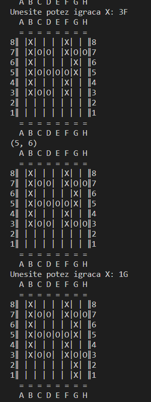

# 🧩 X and O Grid Game (Python)

## 📌 Description

This is a two-player terminal game where players take turns placing their symbols (`X` or `O`) on a grid.

- **X** places two vertical cells.
- **O** places two horizontal cells.

The game ends when a player can no longer make a valid move.

## ▶️ How to Play

1. Choose who goes first (`X` or `O`).
2. Set the number of columns and rows.
3. Enter moves using coordinates (e.g., `51` = row 5, column A).
4. The board updates after each move.
5. Game ends when the current player has no valid moves left.

## 🛠️ Features

- Custom grid size
- Turn-based play
- Real-time move validation
- Text-based board display

Built with Python using basic input, loops, and 2D lists.

### Example of pc and player moves:

